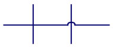

# This is a page to reference for things I want to include on my website

## Design Changes
* My logo currently has gaps like found in [this video](https://www.youtube.com/watch?v=rGHlAS7AccY). I want to change it to old schematic designs where the wires are big loops jumping over each other, like this 
Could also do something terminal based with "> JasonLedon" and make it look like prompt with green font
* Make it responsive to different media sizes (If the screen size is too small, switch to icons only)
* Website should match the design of my resume

## Considerations
* Should I use Django, React, or some other sort of framework?
* Should I code all of these tools in python or javascript

## Pages
### Work Experience
* Logos of all of the places ive worked (all the even ones on the left side, all the odd ones on the right side) 
### Certifications
* Link to SW certification center
* Display all certification for solidworks, mastercam, engineering
* Link to the various youngest CSWE articles under the expect cert
* include QR codes for verificaton
### Home
* Resume preview (include download button)
### Online Tools
* FSM/Tree generator like the one seen [here](https://madebyevan.com/fsm/)
* HEX/Binary/Octal/Decimal addition/subtraction/multiplicaton/division calculator where you can specify a bit-width. It will indicate if it overflowed, underflowed, etc. Should also indicate if using 2s complement
* CSS playgound. A bunch of default css that you can view the text for and modify it and see it update real time. Example in "Old/html/html_previewer.html"
### Projects
* Rapid prototyping designs

## Header and Footer
### Header
* Logo and navbar to my various pages
### Footer
* Contact information
    * LinkedIn
    * Phone Number
    * Email
    * GitHub
    * Youtube channel

## Old things
* progress bar as you scroll through it shows you how far you have left
* graphing integration on SOMETHING, using AJAX and chart.js to get an interactive webpage
* speicfy that I wrote all the JS, html, css and no bootstrap was used. Only chart.js for graphing
* a thing like on the apple website where as you scroll down it looks like you arent moving but the image is changing somehow
* css animations
* maybe a gant chart of all the places ive worked and also been in school
* link to my ahk scripts
* as you hover over text, it should update or have fun effects